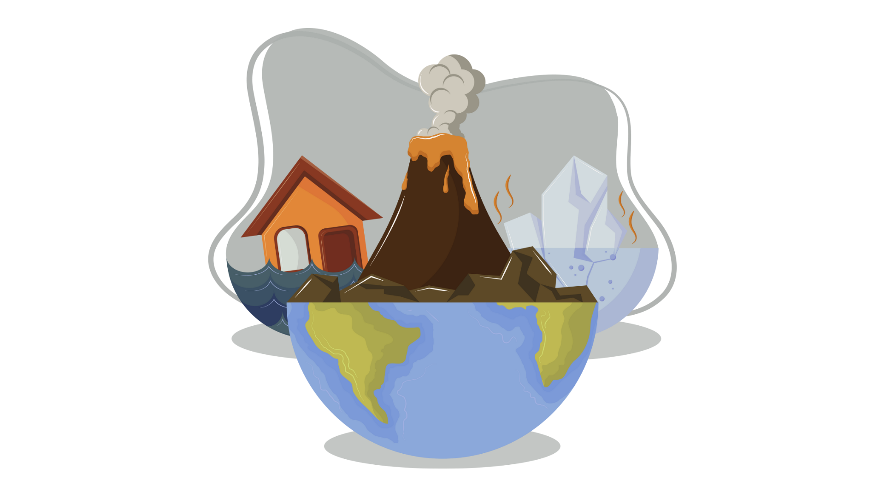

# Understanding Disaster Risk with the WorldRiskIndex

## Motivation
Every year, millions of people around the world face the consequences of extreme natural events such as earthquakes, storms, and floods. While the intensity of these events is important, the societal framework and response structures are equally critical in determining the magnitude of the disaster.

The WorldRiskReport aims to contribute to a global view of the links between natural hazards, climate change, development, and disaster risk reduction, and to draw forward-looking conclusions for aid, policy, and reporting.

## Objective
The goal of the analysis is to identify and understand the complex interactions between natural hazards, socio-economic vulnerability, and infrastructure resilience as reflected in the WorldRiskIndex.  It also aims to uncover patterns in the interaction of the dimensions that could contribute to data-driven decision-making and support disaster risk management.

The analysis is therefore guided by the question: *"How do the complex interactions between natural hazard exposure and socioeconomic vulnerability contribute to patterns that can inform data-driven decision-making?"*

## Key Questions
* Which regions or countries are most exposed to natural catastrophes?
* Are there patterns in risk index scores based on geographic factors?
* How do the different criteria contribute to the WRI?
* Are there specific criteria that influence the final index more than others?

## Project Tasks & Deliverables
* Sourcing Open Data
* Exploratory Data Analysis
* Geographical Visualizations with Python
* Supervised Machine Learning: Regression
* Unsupervised Machine Learning: Clustering
* Sourcing & Analyzing Time Series Data
* Creating Data Dashboards

## Analytical Techniques
* Exploratory analysis through visualizations:
  * Scatterplots
  * Correlation heatmaps
  * Pair plots
  * Categorical plots
* Geospatial analysis using a shapefile
* Linear regression analysis
* k-means cluster analysis
* Time-series analysis

## Analysis Tools
* Uses Jupyter notebooks and the following Python libraries for analysis:
  * Pandas: for data analysis
  * Numpy: for mathematical equations
  * Seaborn: for data visualizations
  * Matplotlib: for data visualizations
  * SciPy: for mathematical equations
  * Folium: for geospatial visualizations
  * Scikit Learn: for machine learning algorithms

## Data Source
["World Disaster Risk Dataset"](https://www.kaggle.com/datasets/tr1gg3rtrash/global-disaster-risk-index-time-series-dataset) by Mrinal Tyagi, accessed via Kaggle.

This dataset of the WorldRiskIndex was originally sourced from the WorldRiskReport 2021 and includes four additional dimensions that are classifications of the WorldRiskIndex, Exposure, Vulnerability, and Susceptibility into the ordinal categories very low, low, medium, high, and very high based on their scores. These classifications and the thresholds for each category are defined in the WorldRiskReport.

The original dataset is part of the WorldRiskReport which is published annually by [Bündnis Entwicklung Hilft](https://www.entwicklung-hilft.de/). The basic model of the WorldRiskIndex was developed in collaboration with the United Nations University Institute for Environment and Human Security (UNU-EHS). Since 2018, the Institute for International Law of Peace and Armed Conflict (IFHV) at the Ruhr-Universität Bochum has taken over the calculation and further developed the model conceptually and methodologically. In 2022, the WorldRiskIndex was published with a completely revised model that includes 100 indicators from publicly available databases worldwide. 

Supportive datasets:
* ["Climate at a Glance: Global Time Series"](https://www.ncei.noaa.gov/access/monitoring/climate-at-a-glance/global/time-series), NOAA National Centers for Environmental Information
* ["Human Development Index"](https://hdr.undp.org/data-center/human-development-index#/indicies/HDI), United Nations Development Program (UNDP)

## Cleaning Procedures
* Missing values were inserted with data from the original reports published by [Bündnis Entwicklung Hilft](https://www.entwicklung-hilft.de/).
* Inconsistent country names were unified to their official names as of 2023.

## Final Project Presentation
The final project presentation was created using Tableau Public and can be viewed in the [Tableau Storyboard](https://public.tableau.com/app/profile/sarahtischer/viz/UnderstandingDisasterRiskwiththeWorldRiskIndex/UnderstandingDisasterRisk). The storyboard provides a comprehensive overview of the data-driven narrative developed throughout the project.
  
